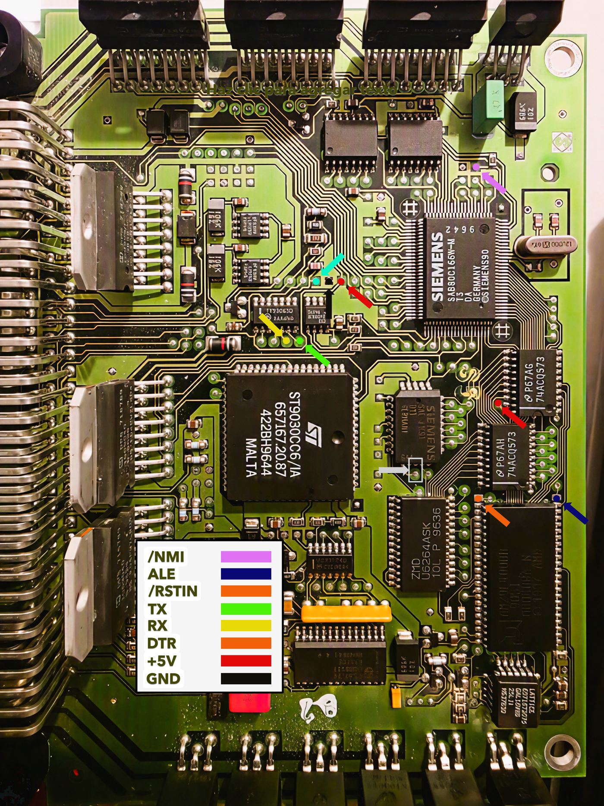

# MS41 BSL Unbricker

In-circuit recovery tool for the BMW **MS41.x** ECU (Siemens **SAB 80C166** CPU +
Intel **28F200** flash). It reprograms the **entire** 28F200 over the 80C166
**bootstrap loader (BSL)** — no desoldering the FLASH, no diagnostic session, every block
including the boot/reset vectors.

The BSL lives in CPU silicon and runs regardless of flash contents, so this
recovers a fully corrupt, cross-flashed, or **blank** chip — the cases where the
normal diagnostic flash path can't help.

---

## How it works

- **BSL entry** is forced in hardware at reset, then a tiny loader is sent over the
  CPU's serial port (ASC0) into RAM and run from there. A small RAM *monitor*
  provides read / erase / program / verify primitives; the host drives the 28F200's
  Intel command set through it.
- **Address mapping.** The board's GAL maps flash `A13 = !CPU A14`, so a file/chip
  image is the CPU image XOR `0x4000` per 16 KB block (a `.bin` read on a bench
  programmer is in *file* order; the tool converts automatically).
- **BSL shadow.** In bootstrap mode the CPU's `0x0–0x7FFF` is overlaid by the
  bootstrap ROM. The low blocks are reached through a `+0x40000` address-wrap alias
  (the external bus wraps within 256 KB), so erase/program/verify still hit real
  flash. The tool detects the shadow and routes those blocks automatically.

## 28F200 block map (CPU addresses)

| region | CPU range | size | notes |
|---|---|---|---|
| `boot` | `0x00000–0x01FFF` | 8 KB | reset/trap vectors (low; via alias) |
| `program-low` | `0x02000–0x03FFF` | 8 KB | (low; via alias) |
| `program-mid` | `0x04000–0x07FFF` | 16 KB | 28F200 HW-locked boot block — needs RP#=12 V (low; via alias) |
| `tune` | `0x08000–0x1FFFF` | 96 KB | calibration / tune |
| `program-high` | `0x20000–0x3FFFF` | 128 KB | program code |

---

## Hardware setup

The connections below are made at the DME PCB test points shown here:



1. **Serial:** a direct TTL tap on ASC0 — **TxD0 (P3.10)** and **RxD0 (P3.11)** — to a
   3.3 V/5 V USB-serial adapter (FT232). Full-duplex direct tap is the only mode.
2. Connect GND from the adapter to DME GND.   
3. **Force BSL at reset:** **ALE (pin 25) HIGH through a 2.2K resistor to +5V** and
   **Connect ALE (pin 25) and NMI# (pin 29) together**.
4. Wire RSTIN# to the adapter's DTR and let the tool pulse it with `--reset-line dtr` (active-low;
   add `--reset-invert` if a transistor inverts the line).
5. Bridge K-Line input to 5V. This will trigger current protection and release RX line for FULL-Duplex.
6. **Programming voltage:** **12 V on the 28F200 VPP pin** is required for any
   erase/program. On this ECU VPP and RP# share a net, so that one 12 V supply also
   unlocks the HW-locked boot block (`program-mid`).

Note: A FTDI232 adapter is recommended.

---

## Install

Pick one — all three take the **same arguments**:

**1. Standalone Windows executable** (no Python needed). Download `bsl_unbrick.exe` from the
[latest release](https://github.com/CAATZ/MS41-BSL-Unbricker/releases) and run it from a terminal:
```bash
bsl_unbrick.exe --port COM4 --reset-line dtr id
```
First run may trip Windows SmartScreen / antivirus — a known PyInstaller false positive; click
*More info → Run anyway*.

**2. pip** (any OS, Python 3.8+). Install the wheel from the release; it pulls in pyserial and
adds an `ms41-bsl-unbrick` command:
```bash
pip install ms41_bsl_unbrick-1.0.0-py3-none-any.whl
ms41-bsl-unbrick --port COM4 --reset-line dtr id
```

**3. From source** (Python 3.8+):
```bash
pip install -r requirements.txt      # just pyserial
python bsl_unbrick.py --port COM4 --reset-line dtr id
```

---

## Usage

The `flash` command is **safe by default**. Without `--arm` it's a **dry run**: it prints
the full plan — which block it will erase, the exact program window, and the variant
check — and **does not open the serial port or touch the ECU at all**. Review the plan,
then re-run the *same* command with `--arm` to actually erase + program + verify.

> The examples use `python bsl_unbrick.py`; if you installed the **exe** or the **pip package**,
> swap in `bsl_unbrick.exe` or `ms41-bsl-unbrick` instead — the arguments are identical.

```bash
# confirm BSL entry (0x55) + that loaded code runs (0xA5) — no flash risk
python bsl_unbrick.py --port COM4 --reset-line dtr sync

# identify the flash chip (manufacturer + device ID; non-destructive, no 12V)
python bsl_unbrick.py --port COM4 --reset-line dtr id

# dump the whole chip to a file-order .bin (bench-flashable layout)
python bsl_unbrick.py --port COM4 --reset-line dtr dump dump.bin --file-order

# preview a flash — DRY RUN: prints the plan, opens nothing, touches nothing
python bsl_unbrick.py --port COM4 --reset-line dtr flash tune --ref image.bin

# ...looks right? run the SAME command with --arm to actually do it
python bsl_unbrick.py --port COM4 --reset-line dtr flash tune --ref image.bin --arm

# flash the WHOLE chip — for a corrupt/virgin flash (add --arm to execute)
python bsl_unbrick.py --port COM4 --reset-line dtr --speed mid flash all --ref image.bin --arm
```

- **`--ref`** is a full file-order 256 KB image for any region, **or** a 24 KB
  calibration partial for `tune`.
- **`--speed slow|mid|fast`** = 9600 / 19200 / 38400 baud. The ECU's bootstrap
  auto-baud sets the ceiling; `mid` (19200) is the reliable sweet spot. If a faster
  preset returns a garbled sync, drop down one.
- **Variant guard:** flashing a calibration checks the reference's MS41 variant
  against the ECU's and **refuses a mismatch** (the classic brick). A **blank/virgin
  ECU** has no variant to compare, so it is allowed — you can flash a fresh/erased
  chip. Override a mismatch with `--force` only if you are certain.
- **Checksum guard:** before flashing, the reference's MS41 checksums (boot, program,
  calibration) are verified. The tool **respects the ECU's disable switches** — a bad
  checksum whose verification is *off* only warns (e.g. MS41.3 ships with an invalid
  program checksum but program verification disabled at `0x605C`, which is fine). A bad
  checksum whose verification is *on* is **refused**; either:
    - add **`--fix-checksums`** to recompute and correct it in memory before flashing
      (only the stored checksum bytes change; for MS41.3 the program checksum is left
      as-is since it's disabled), or
    - add **`--force`** to flash anyway.
- A read-back **verify** runs after every program; a backup of each block is saved
  before erasing (skip with `--no-backup`).

Run `python bsl_unbrick.py --help` for the full option list.

---

## Warnings

- Erasing/programming with the wrong or incomplete image can leave the ECU
  unbootable. Because BSL is independent of flash contents, you can always re-run to
  recover — but don't power-cycle into "run the engine" until a flash reports
  `MATCH`.
- Keep the 12 V VPP supply stable during erase/program.
- For research / educational use and recovery of your own ECU. No warranty.

---

## Acknowledgements

This tool stands on public hardware documentation and prior community work:

- **Infineon / Siemens** — the *SAB 80C166* datasheet and the *80C166 Bootstrap Loader*
  application note: the BSL entry sequence, ASC0 serial protocol, and the half-duplex caveat.
- **Intel** — the *28F200BX* flash datasheet: the command set (erase / program / Read-ID),
  block map, status register, and identifier codes.
- **[RomRaider](https://www.romraider.com/)** — MS41 ROM definitions and community reverse
  engineering, used for variant / CAL-ID identification and the checksum-disable control bits.
- **[Siemens_MS41_Checksum](https://github.com/kimfreding/Siemens_MS41_Checksum)** (kimfreding)
  and **[pyms41](https://github.com/OpenMS41/pyms41)** (jpiccari) — the MS41 CRC-16 checksum
  work that `ms41_checksum.py` builds on.
- **[Siemens-MS41](https://github.com/ba114/Siemens-MS41)** (ba114) — MS41 reverse-engineering ECU definitions.
- **[c166-ghidra-module](https://github.com/keyhana/c166-ghidra-module)** (keyhana) — the C166
  SLEIGH processor module for **[Ghidra](https://github.com/NationalSecurityAgency/ghidra)**,
  used to disassemble and assemble the RAM monitor and the 0xFA40 stubs.

Thanks also to **[grantUser](https://github.com/grantUser)** for collaborative ideation.

---

## License

MIT — see [LICENSE](LICENSE). (Set the copyright holder line in `LICENSE` before publishing.)
